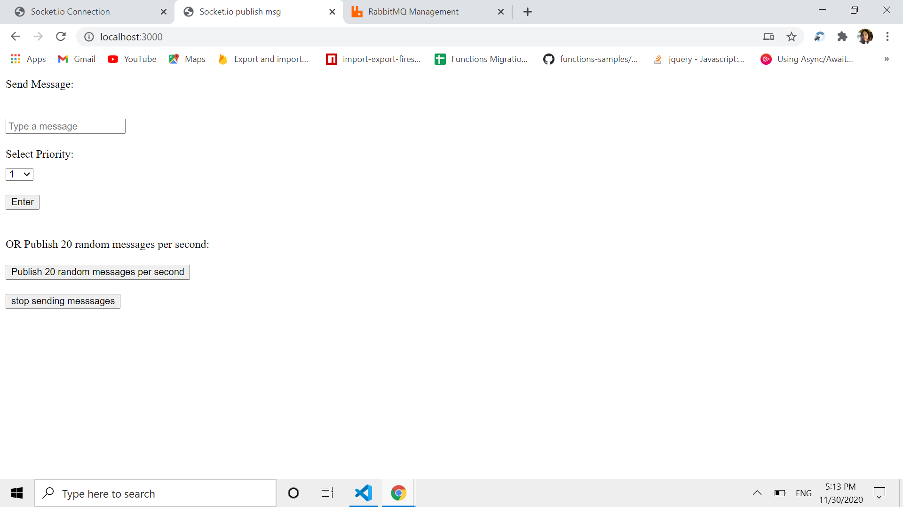
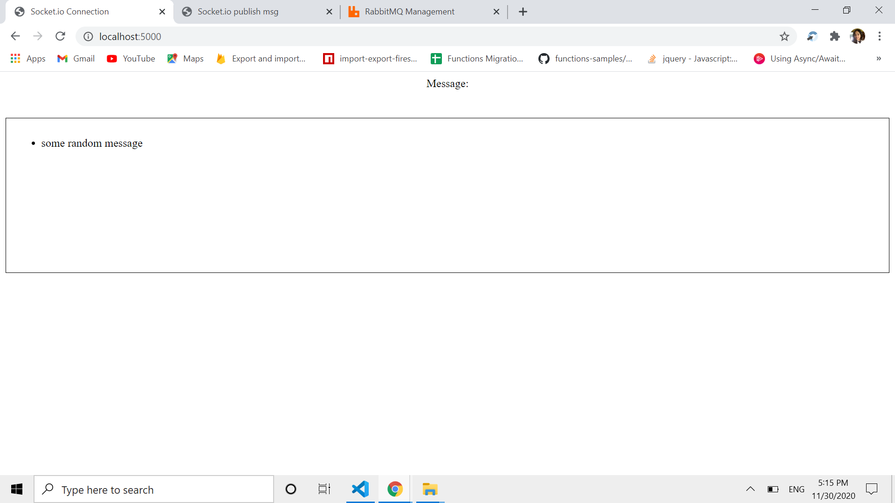

1. Introduction to Publisher Subscriber architecture

Publish subscribe architecture is a message protocol where sender of the messages are called publisher. The publishers do not specify directly to whom the message to be sent which is to the subscribers. Event bus acts as a intermediary that collects all messages from the publisher and forward to subscribers based on their interest. Publishers send messages without any knowledge of the subscribers and subscribers receive messages without any knowledge of the publishers.

2. Introduction to Message Queue

Let’s start by defining message queues; how you can use a message queue and the benefits achieved when using message queues. A queue is a line of things waiting to be handled — in sequential order starting at the beginning of the line. A message queue is a queue of messages sent between applications. It includes a sequence of work objects that are waiting to be processed. A message is the data transported between the sender and the receiver application; it’s essentially a byte array with some headers on top. An example of a message could be an event. One application tells another application to start processing a specific task via the queue. The basic architecture of a message queue is simple; there are client applications called producers that create messages and deliver them to the message queue. Another application, called a consumer, connects to the queue and gets the messages to be processed. Messages placed onto the queue are stored until the consumer retrieves them.

3. Introduction to WebSocket

WebSocket is a computer communications protocol, providing full-duplex communication channels over a single TCP connection. The WebSocket protocol enables interaction between a web browser (or other client application) and a web server with lower overhead than half-duplex alternatives such as HTTP polling, facilitating real-time data transfer from and to the server. This is made possible by providing a standardized way for the server to send content to the client without being first requested by the client, and allowing messages to be passed back and forth while keeping the connection open. In this way, a two-way ongoing conversation can take place between the client and the server.

3. Technologies Used

- Node.js
- Express.js
- RabbitMQ
- Socket.io
- HTML

4. Steps for Setup

- The repository contains two applications, a Publisher application (./AppPublisher) and a Subscriber application(./AppSubscriber)

- The first thing that need to be setup is rabbitMQ instance, it can be set both locally and in cloud. I created a free account for cloud setup at <a href="https://www.cloudamqp.com/">cloudamqp</a>

- After creating the free account, create a new instance with any name
- Then click on the instance name in the instance table. There in the Details section copy the AMPQ url and save it inside (./AppPublisher/config.json) and (./AppSubscriber/config.json)

- Now click "RabbitMQ Manager" on the instance table and on the queues column

- Add a new queue, give it any name, put Durability to 'Durable'and add 'Maximum priority' or 'x-max-priority' argument and give it a value of 10.

- After the queue is created, copy the queue name and save it inside (./AppPublisher/config.json) and (./AppSubscriber/config.json)

- To install all dependencies perform "npm install" inside both (./AppPublisher) and (./AppSubscriber)

- To run, perform "node server.js" inside both (./AppPublisher) and (./AppSubscriber)
  in two terminals.

- The publisher is serving at port <a href="http://localhost:3000/">3000</a> and the subscriber is serving at port
  <a href="http://localhost:5000/">5000</a>.

- The publisher has two options, publisher can pass the message and priority one at a time or pass 20 messages per second continuosly by clicking the button. This continuity can be stopped by pressing the stop sending messages button.
  

- The subscriber app only display the messages from the queue if the priority is greater or equal to 7.
  
